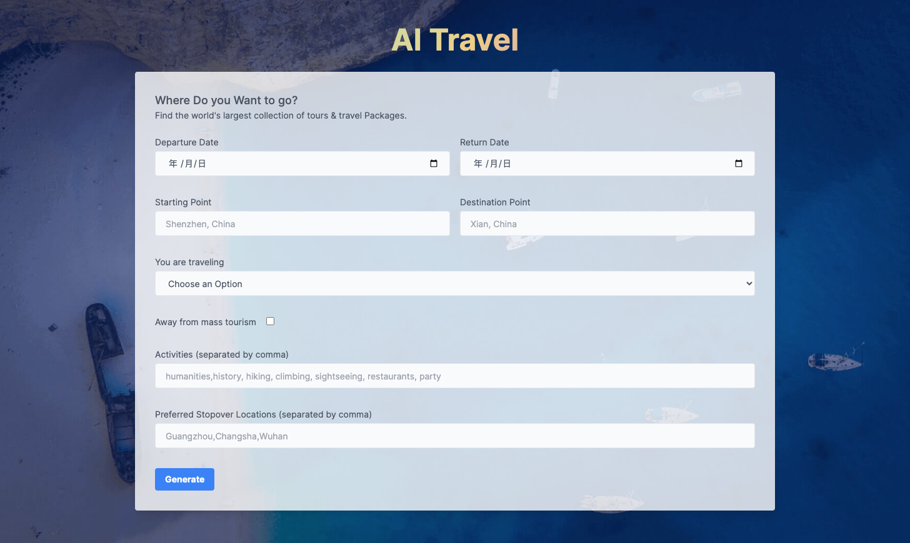
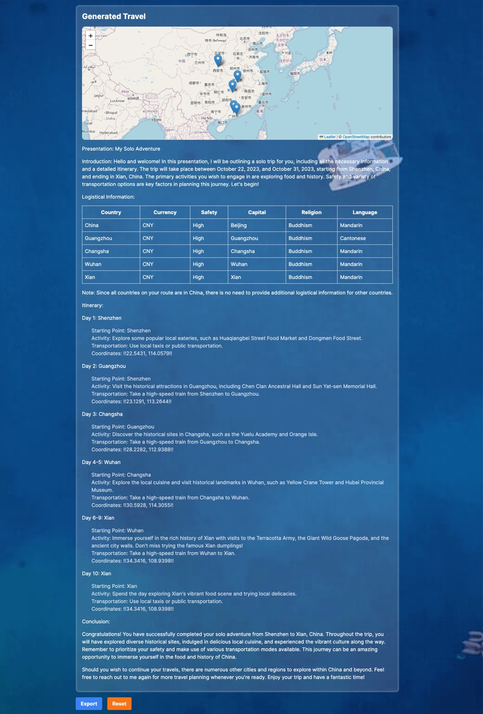

# AI Travel

AI Travel 是一个 `Next.js` 应用程序，从Form表单中获取用户输入，根据定制输入生成旅行行程，应用程序利用 OpenAI 的 GPT 模型生成有关制定旅行的详细信息。行程包括详细的旅程说明，行程地点地图，以及附带的描述性文字。

> 项目的目的是展示人工智能的能力，对于喜欢探索并希望以快速而独特的方式产生旅行想法的人来说，这是一个很好的概念工具。





## Table of Contents

-   美好开始
-   环境变量
-   项目启动
-   贡献说明
-   作者
-   License

## 美好开始

克隆存储库并安装项目依赖包：

```
git clone https://github.com/QuintionTang/AI-Travel
cd AI-Travel
yarn
```

## 环境变量

AI-Travel 使用环境变量对凭证进行安全管理，一种常见的配置管理方式，将项目的配置项添加到文件 `.env`，开发或者部署之前将文件 `.env.example` 重命名为 `.env`。

以下是涉及的环境变量：

-   `OPENAI_API_KEY`: 这是 OpenAI API 密钥，需要向OpenAI API申请。可以从 [OpenAI Dashboard](https://platform.openai.com/overview) 获取。
-   `OPENAI_MODEL`: OpenAI 模型的配置参数。例如，如果使用 `gpt-3` 模型，`OPENAI_MODEL` 的值设置为 `gpt-3.5-turbo`。

## 项目启动

启动 Next.js 服务：

```
yarn dev
```

应用程序将在运行在地址： [http://localhost:3000](http://localhost:3000/)

## 贡献说明

欢迎更多的贡献！如果想贡献代码，请创建一个 Pull Request，它将在代码审查后被合并。

> 目前只是使用英语来定制行程，后续需要支持中文，支持更多的定制化，真正让AI为生活带来便利。

请记住，这个项目的目的是提高社区对AI技术的理解和使用，并展示AI如何在现实世界中使用，如旅行规划。因此，任何有助于实现这一目标的贡献都非常感谢。

## 作者

这个项目由[QuintionTang](mailto:QuintionTang@gmail.com)创建。如果您有任何问题或意见，请随时与我联系，非常欢迎。

## License

这个项目是免费提供免费的非商业用途。未经明确许可，请勿将本项目用于商业用途。
